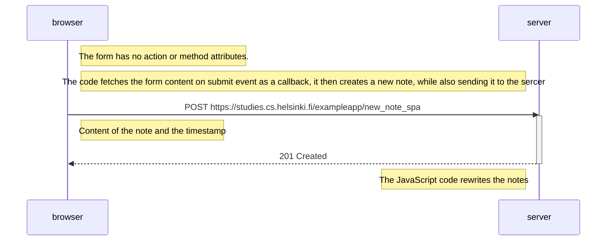

```mermaid
sequenceDiagram
    participant browser
    participant server
    Note right of browser: The form has no action or method attributes.
    Note right of browser: The code fetches the form content on submit event as a callback, it then creates a new note, while also sending it to the sercer
    browser->>server: POST https://studies.cs.helsinki.fi/exampleapp/new_note_spa
    activate server
    Note right of browser: Content of the note and the timestamp
    server-->>browser: 201 Created
    deactivate server
    Note left of server: The JavaScript code rewrites the notes
```